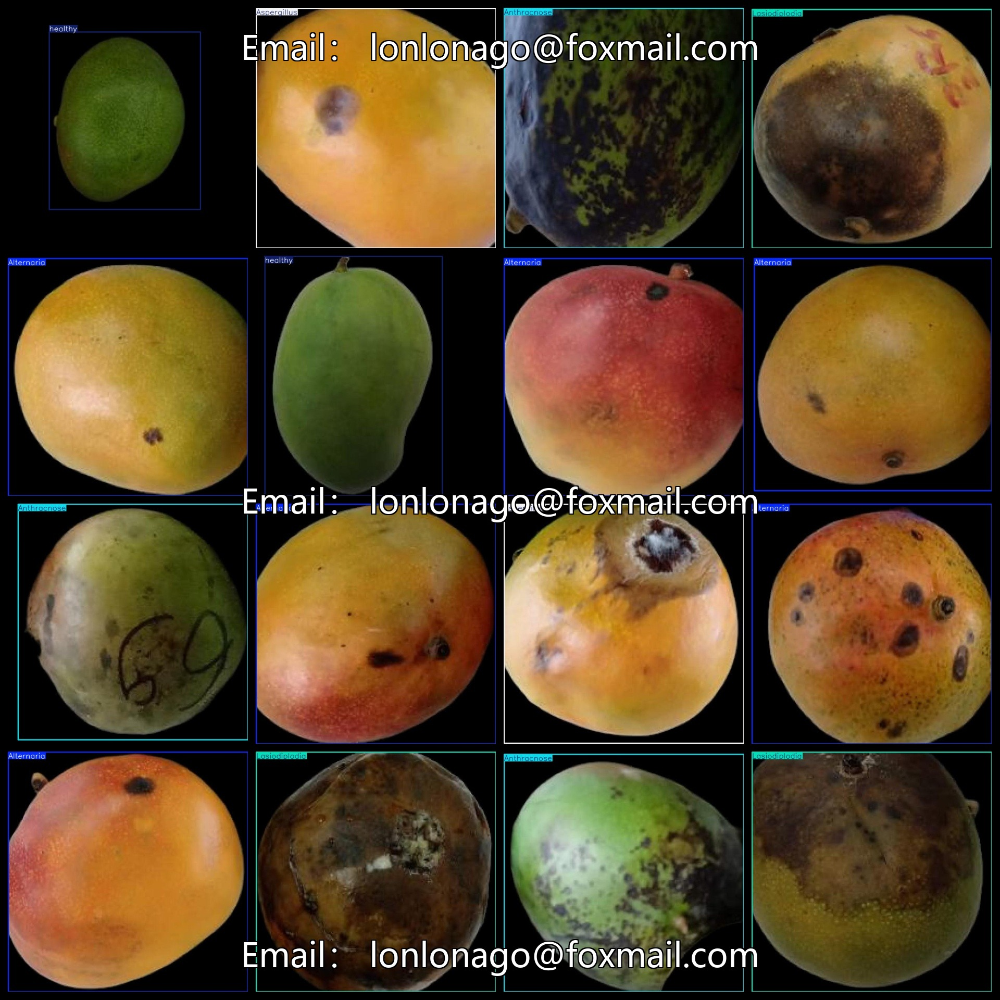

# Mango Disease Detection Dataset 1989 imagesVOC+YOLO format

The dataset for Detecting diseases in mangoes is a collection of 1989 images labeled with their respective diseases. The format includes VOC+YOLO.

Dataset format: Pascal VOC format + YOLO format (the txt file does not contain the split path, it only contains jpg images and corresponding VOC format xml files and yolo format txt files)

Number of images (number of jpg files): 1989

Number of xml files: 1989

Number of txt files: 1989

Number of callout categories: 5

The Github repository is: datasets_sl

["Alternaria", "Anthracnose", "Aspergillus", "Lasiodiplodia", "healthy"]

Tag Translation: "Colletotrichum" "Bacillus anthracis" "Aspergillus" "Erysiphe" "Healthy"

Number of boxes labeled in each category:

Alternaria frame count = 389

Anthracnose frame count = 309

Aspergillus 428

Lasiodiplodia frame count = 374

healthy frame count = 489

Total frames: 1989

Number of images per category:

Alternaria occupies 389 images.

Anthracnose occupies = 309

Aspergillus occupies a total of 428 pictures.

Lasiondiplodia occupies 374 images.

Healthy occupancy rate = 489

Image resolution: 640x640

Use the labeling tool: labelImg

Dataset Augmentation: Yes

Rules for annotation: Draw a rectangle around the category.

Important note: The dataset does not have been divided into training, validation, and testing sets.

Special Disclaimer: This dataset does not guarantee the accuracy of the trained models or weight files.

Annotation and image details are as follows:

## Images

---

Here is a pay link on Stripe (https://buy.stripe.com/3cs8yP7sY87d0vu9AB). Please contact me lonlonago@foxmail.com after funding $89, and I will send you a complete data files, thank you!

